= TP2 Régulation numérique
Robin SHAMSNEJAD
:source-highlighter: rouge
:stem: latexmath
:toc:

== Introduction

Ce TP a pour but de visualiser les caractéristiques d'une transformée en Z des
fonctions et paramètres suivants en utilisant MATLAB. Chaque ligne n'a été faite
que pour une seul valeur de chaque paramètre lorsque plusieurs étaient proposées.

.Fonctions de transfert
[options="header",cols="^,^,^,^"]
|====
| Numéro    | Procédé stem:[G_p(s)]                                                                 | Paramètres                                    | stem:[T_e]
| 1         | stem:[\displaystyle{\frac{1}{1+T \cdot s}}]                                           | stem:[T = 10 s]                               | stem:[T_e = 0.01T]
| 2         | stem:[\displaystyle{\frac{e^{-L \cdot s}}{1 + T \cdot s}}]                            | stem:[T = 10 s, ~ L = 2 s]                    | stem:[T_e = 0.01T]
| 3         | stem:[\displaystyle{\frac{1}{(1 + T_1 \cdot s)(1 + T_2 \cdot s)}}]                    | stem:[T_1 = 1 s, ~ T_2 = 10 s]                | stem:[T_e = 0.01T_2]
| 4         | stem:[\displaystyle{\frac{\omega_n^2}{\omega_n^2 + 2 \zeta \omega_n \cdot s + s^2}}]  | stem:[\omega_n = 0.05 rad/s, ~ \zeta = 0.1]   | stem:[T_e = 1 s]
| 5         | stem:[\displaystyle{\frac{1}{(1 + T_1 \cdot s)(1 - T_2 \cdot s)}}]                    | stem:[T_1 = 1 s, ~ T_2 = 10 s]                | stem:[T_e = 0.01 T_2]
|====

== Fonction 1

.Script MATLAB pour transformer en Z la fonction de transfert et en afficher les caractéristiques
[source, matlab]
----
include::releves/equ1/transfoz01.m[]
----
[source]
----
include::releves/equ1/resultats.txt[]
----

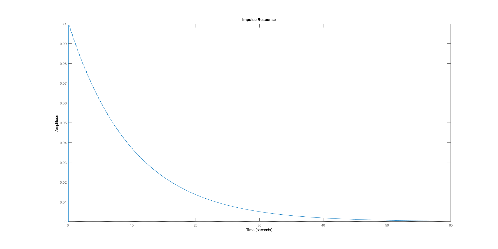

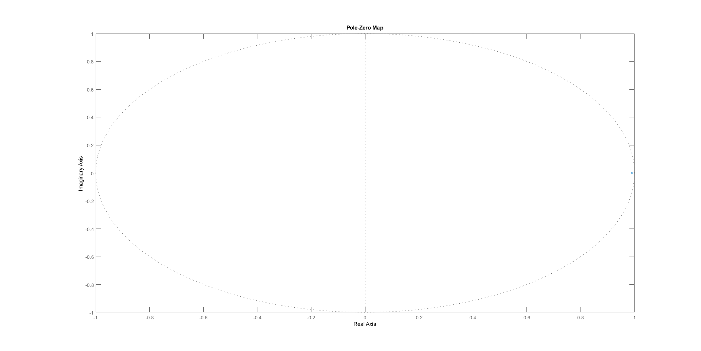
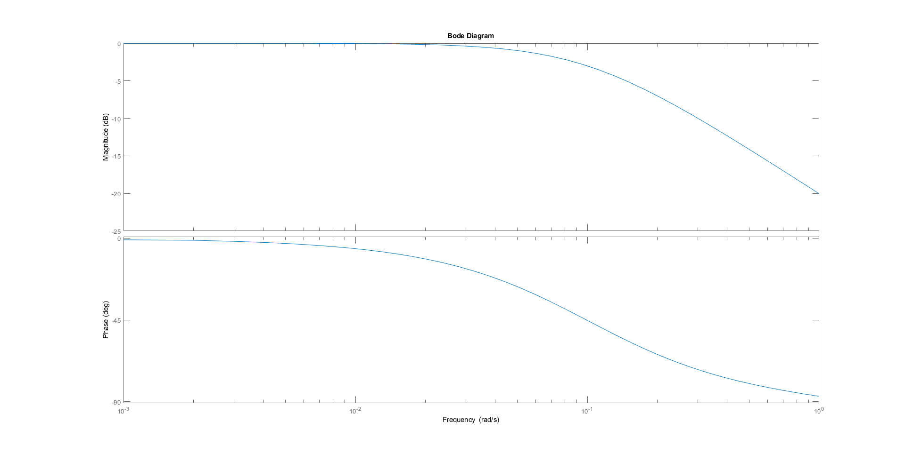

== Fonction 2

[source, matlab]
----
include::releves/equ2/transfoz02.m[]
----
[source]
----
include::releves/equ2/resultats.txt[]
----

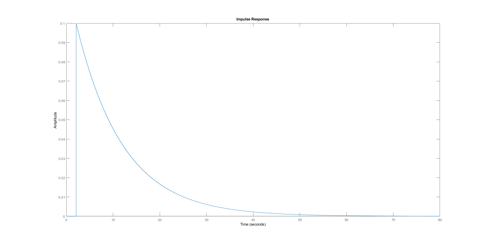
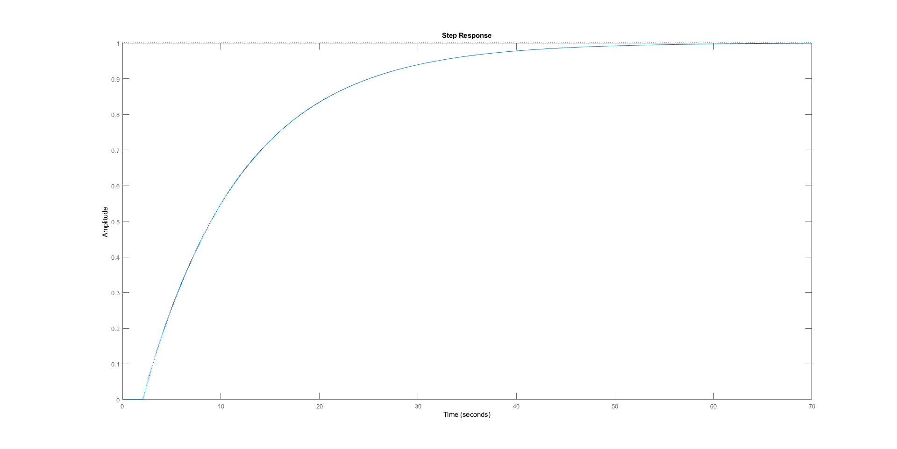

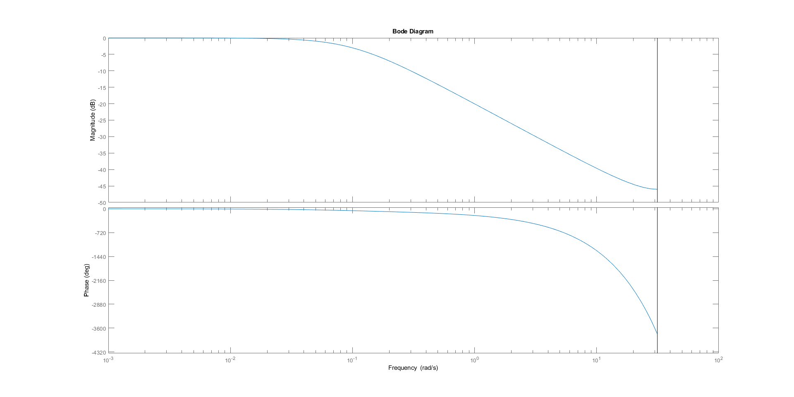

== Fonction 3

[source, matlab]
----
include::releves/equ3/transfoz03.m[]
----
[source]
----
include::releves/equ3/resultats.txt[]
----

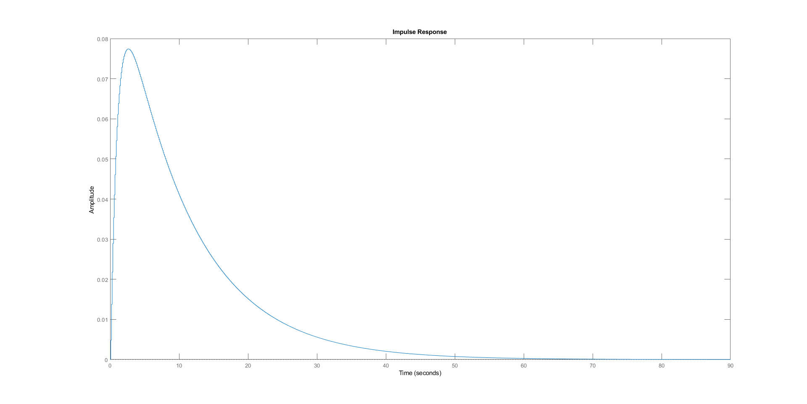
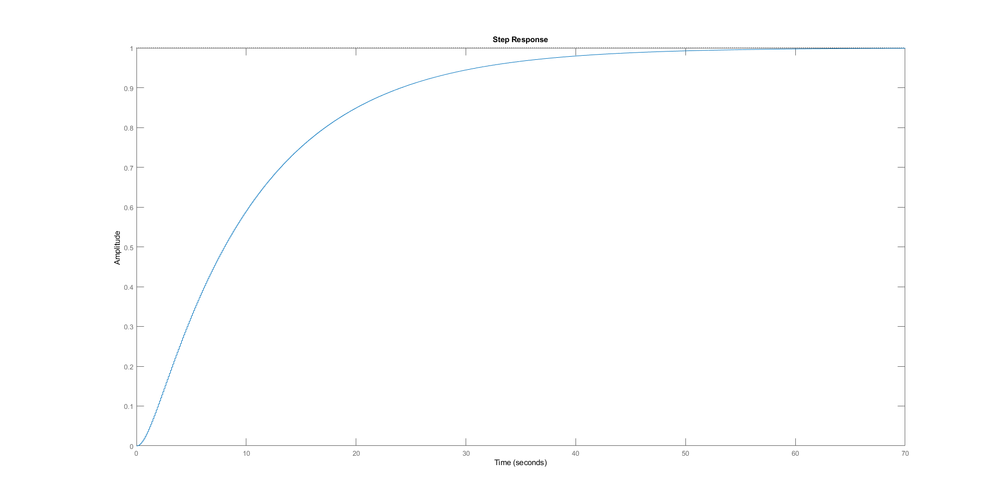

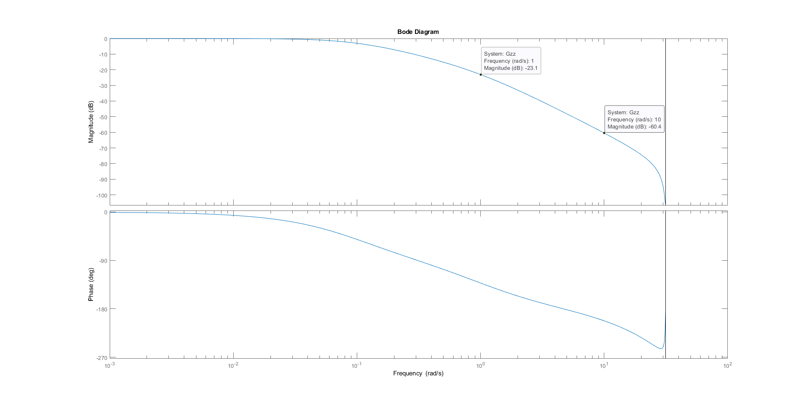

== Fonction 4

[source, matlab]
----
include::releves/equ4/transfoz04.m[]
----
[source]
----
include::releves/equ4/resultats.txt[]
----

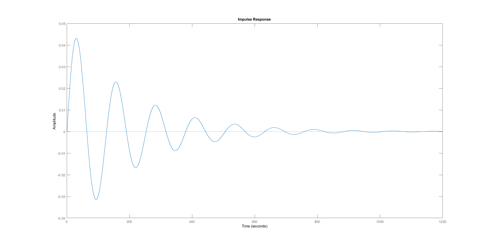
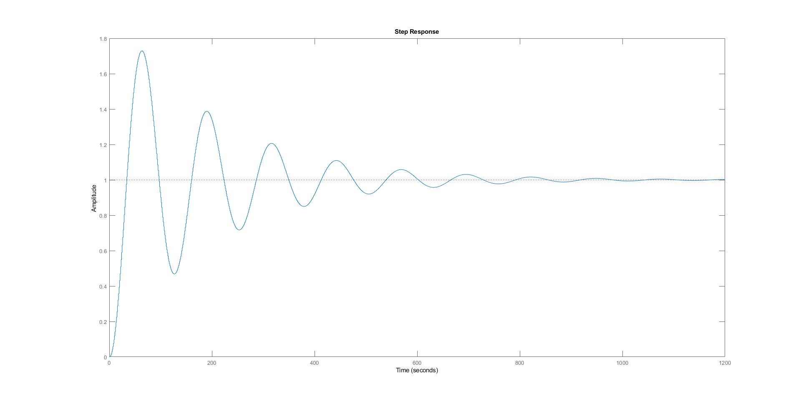
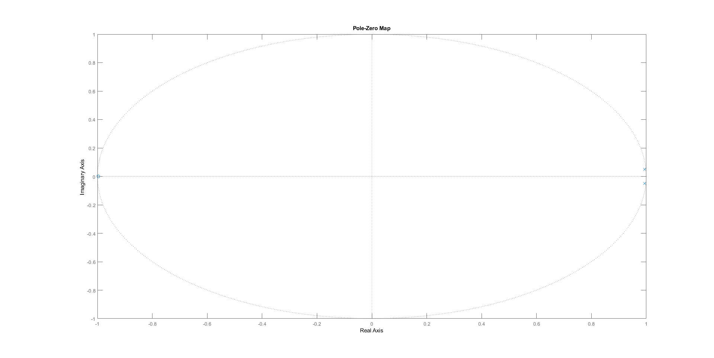
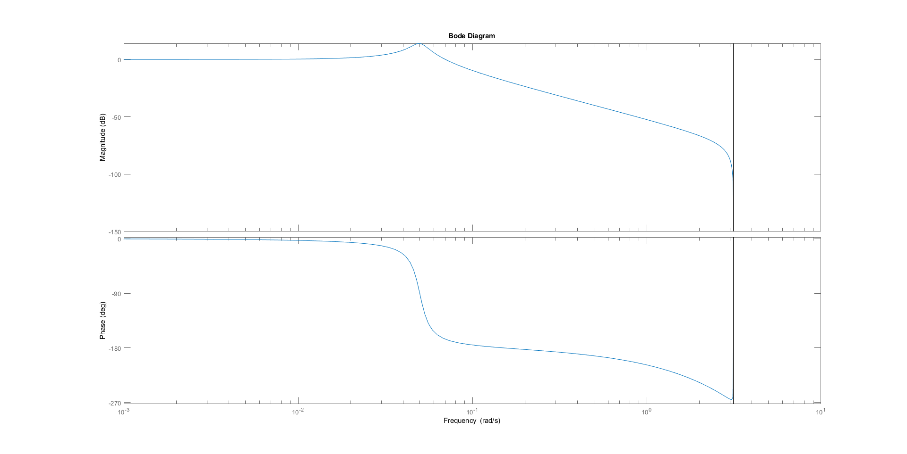

== Fonction 5

[source, matlab]
----
include::releves/equ5/transfoz05.m[]
----
[source]
----
include::releves/equ5/resultats.txt[]
----

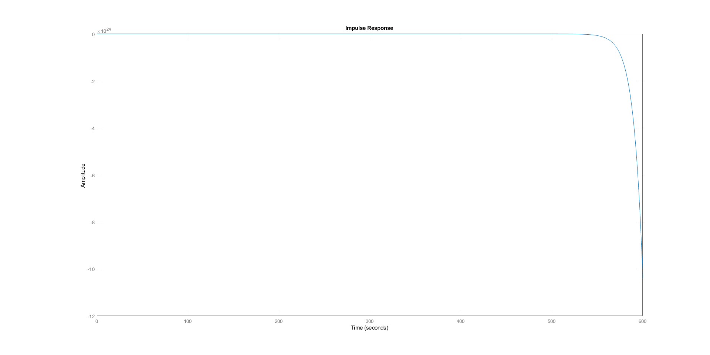
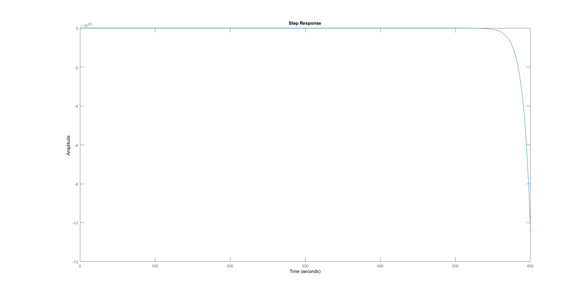
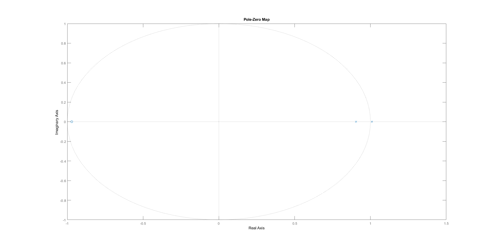
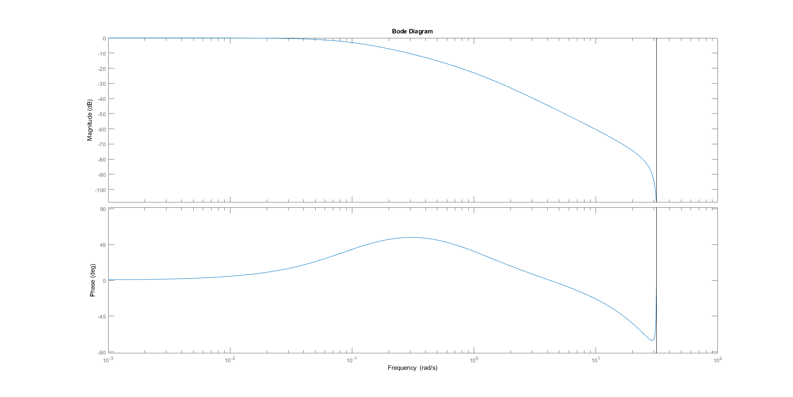

== Relevés

.Comparaison des caractéristiques de chaque fonction de transfert
[options="header",cols="^,^,^,^,^,^,^,^,^"]
|====
| Numéro | Temps de montée (s) | Temps de réponse (s) | Dépassement | Période d'oscillation (s) | Gain statique (dB) | Fréquence de coupure (rad/s) | Pente de coupure (dB/décade) | Pôles / Zéros
| 1 | 23 | 39.1 | stem:[\emptyset] | stem:[\emptyset] | 0 | 0.01 | 20 | 0.99 / stem:[\emptyset]
| 2 | 25.1 | 41 | stem:[\emptyset] | stem:[\emptyset] | 0 | 0.01 | 20 | 0.99 / stem:[\emptyset]
| 3 | 24.2 | 40.3 | stem:[\emptyset] | stem:[\emptyset] | 0 | 0.01 | 40 | 0.99, 0.905 / -0.964
| 4 | 32 | 500 | 73% | 127 | 0 | 0.0772 | 40 | 0.994 + 0.0495i, 0.994 - 0.0495i / -0.997
| 5 | stem:[\emptyset] | stem:[\emptyset] | stem:[\emptyset] | stem:[\emptyset] | 0 | 0.0986 | 20 | 1.01, 0.905 / -0.97
|====

On remarque que les 3 premières ont des caractéristiques tout à fait équivalentes, mis à part la pente de coupure, les pôles et les zéros de celles du second ordre.

On remarque également que les fonctions de transfert du deuxième ordre se distinguent facilement de celles du premier ordre par leurs caractéristiques fréquentielles.

Enfin, on note que la réponse indicielle a une grande importance également : en effet dans la n.5, instable, si l'on se limite à observer son diagramme de Bode, on pourrait croire qu'il s'agit d'un filtre stable du deuxième ordre, alors qu'il est évident qu'il est instable si l'on ajoute l'analyse de sa réponse temporelle ou de ses pôles.