= TP3 Régulation numérique
Robin SHAMSNEJAD
:source-highlighter: rouge
:stem: latexmath
:toc:

== Introduction

.Fonctions de transfert
[options="header",cols="^,^,^,^"]
|====
| Numéro | Procédé stem:[G_p(s)] | Paramètres | stem:[T_e] 
| 1 | stem:[\displaystyle{\frac{1}{1+T \cdot s}}] | stem:[T = \begin{bmatrix} 0.4343 \\ 0.6213 \\ 0.8306 \\ 1.4427 \\ 1.9576 \\ 2.8037 \\ 4.4814 \\ 9.4912 \end{bmatrix} ] | stem:[T_e = 1 sec]
| 2 | stem:[\displaystyle{\frac{1}{(1 + T_1 \cdot s)(1 + T_2 \cdot s)}}] | stem:[T_1, T_2 = \begin{bmatrix} 0.4343 & 2.8037 \\ 0.6213 & 4.4814 \\ 0.8306 & 9.4912 \end{bmatrix}] | stem:[T_e = 1 sec]
| 3 | stem:[\displaystyle{\frac{\omega_n^2}{\omega_n^2 + 2 \zeta \omega_n \cdot s + s^2}}] | stem:[\zeta = 0.5 \\ \omega_n = \begin{bmatrix} 0.6283 \\ 1.2566 \\ 1.8850 \\ 2.5133 \\ 3.1416 \end{bmatrix}] | stem:[T_e = 0.1 sec]
|====

== Fonction 1

.Script MATLAB
[source, matlab]
----
include::releves/equ1/transfoz01.m[]
----

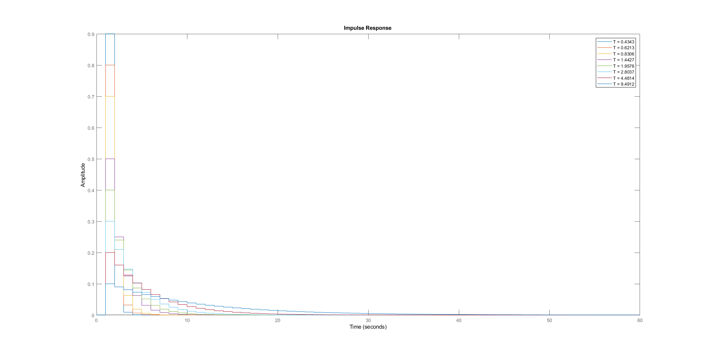
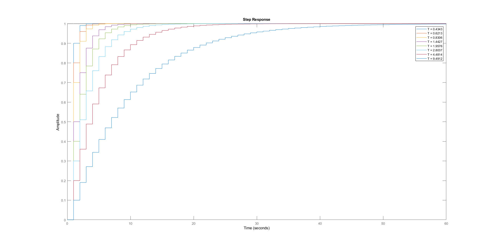
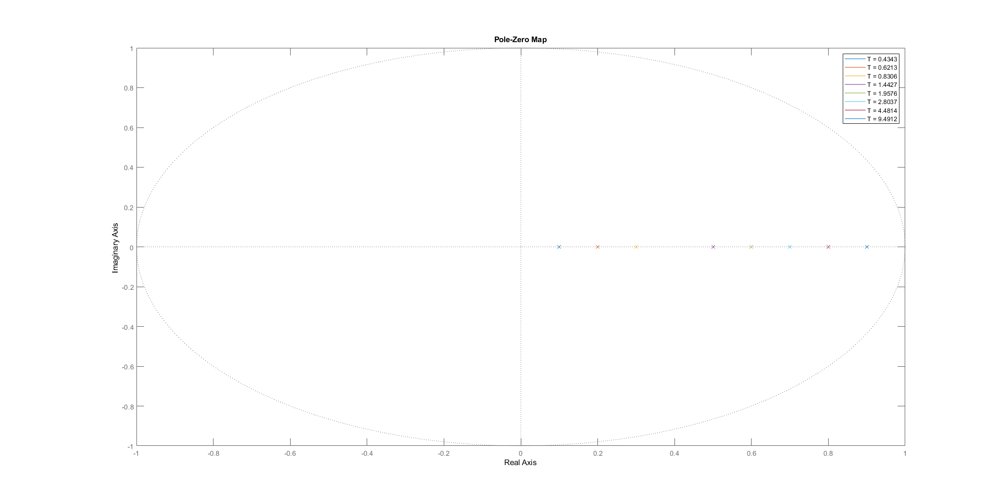
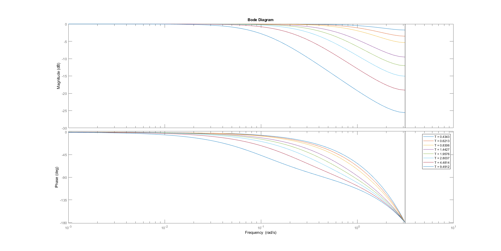

|====
|T (s)|0.4343|0.6213|0.8306|1.4427|1.9576|2.8037|4.4814|9.4912
|Temps de montée (s) |1|2|2|4|5|7|11|22
|Période d'oscillation (s) | stem:[\emptyset]| stem:[\emptyset]| stem:[\emptyset]| stem:[\emptyset]| stem:[\emptyset]| stem:[\emptyset]| stem:[\emptyset]| stem:[\emptyset]
|Gain statique (dB) |0|0|0|0|0|0|0|0
|Fréquence de coupure (rad/s) |2.3|1.61|1.2|0.693|0.511|0.357|0.223|0.105
|====

== Fonction 2

.Script MATLAB
[source, matlab]
----
include::releves/equ2/transfoz02.m[]
----

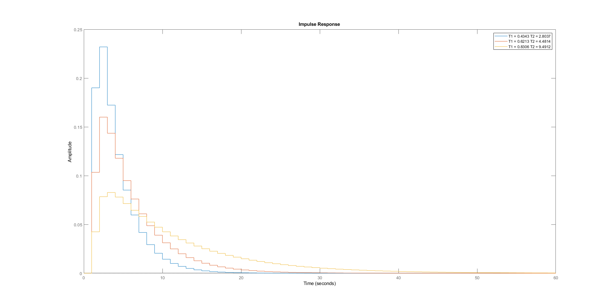
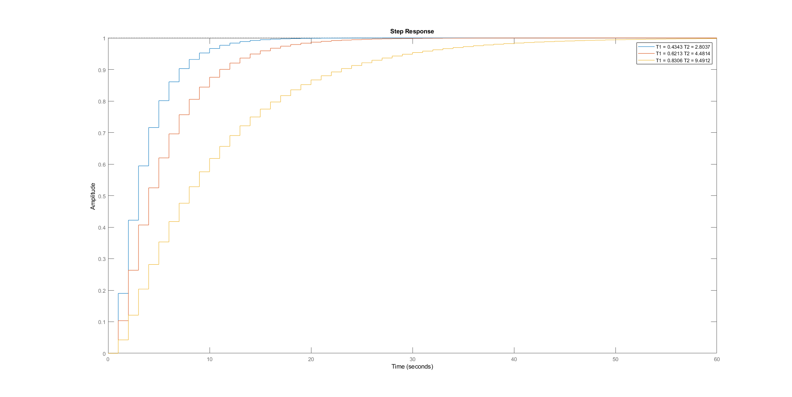
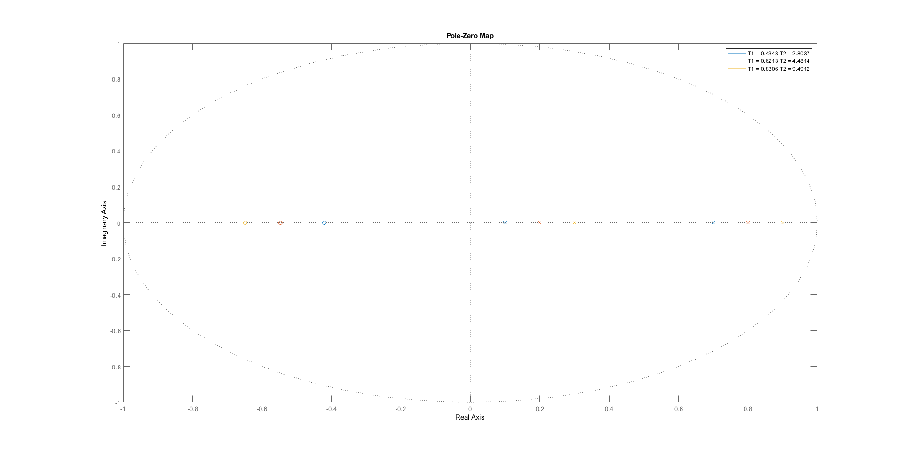
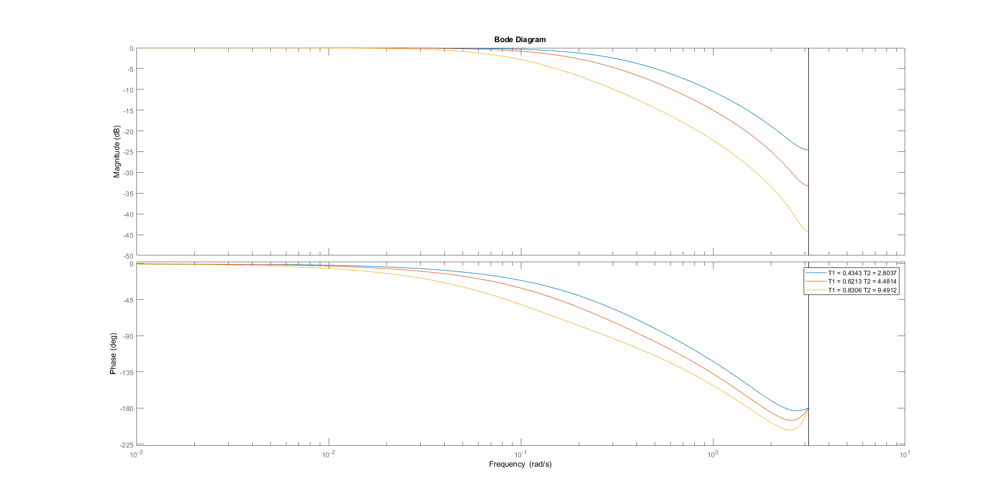

NOTE: Je n'ai pas eu le temps de faire de relevés précis.

== Fonction 3

.Script MATLAB
[source, matlab]
----
include::releves/equ3/transfoz03.m[]
----

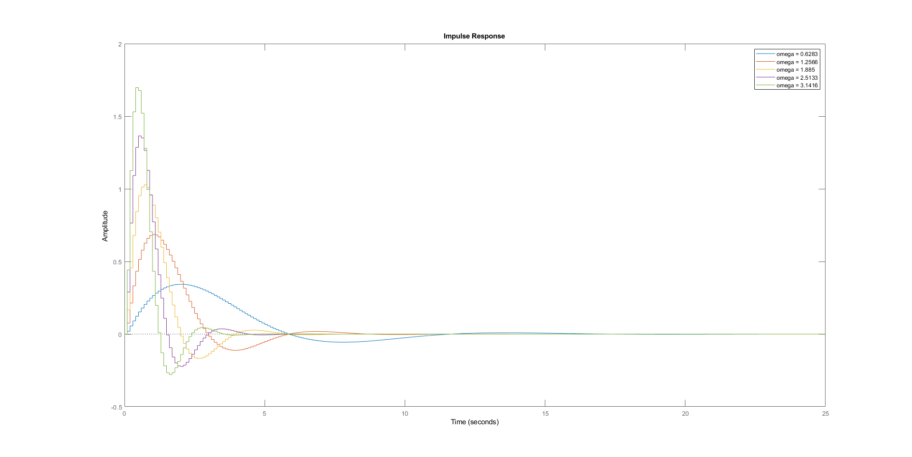
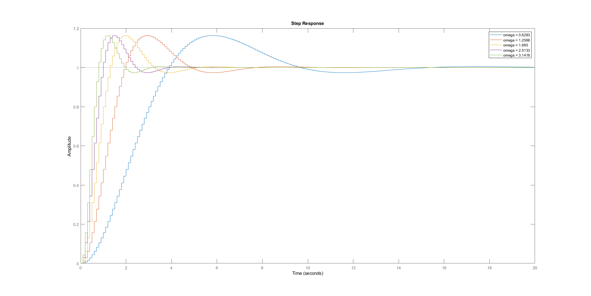
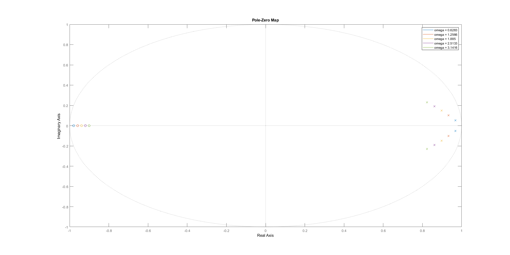
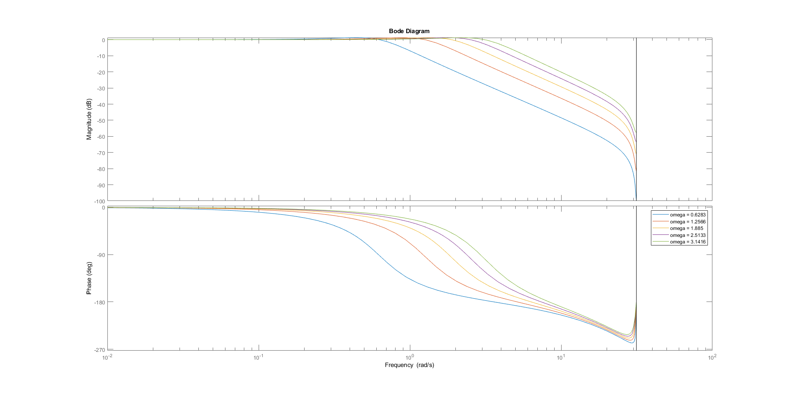

NOTE: Je n'ai pas eu le temps de faire de relevés précis.

== Commentaires

Sur la fonction 1, on remarque que lorsque l'on augmente stem:[T], le temps de montée augmente et la fréquence de coupure diminue. On voit également que les pôles se rapprochent de plus en plus du cercle unité.

On remarques les mêmes phénomènes pour la fonction 2 lorsque stem:[T_1] et stem:[T_2] augmentent.

Dans le cas de la fonction 3, qui est un second ordre oscillant, on remarque que le temps de réponse diminue, ainsi que la fréquence de coupure, lorsque l'on fait augmenter le facteur d'amortissement. Les pôles sont complexes conjugués, et s'éloignent du cercle unité dans ce cas.